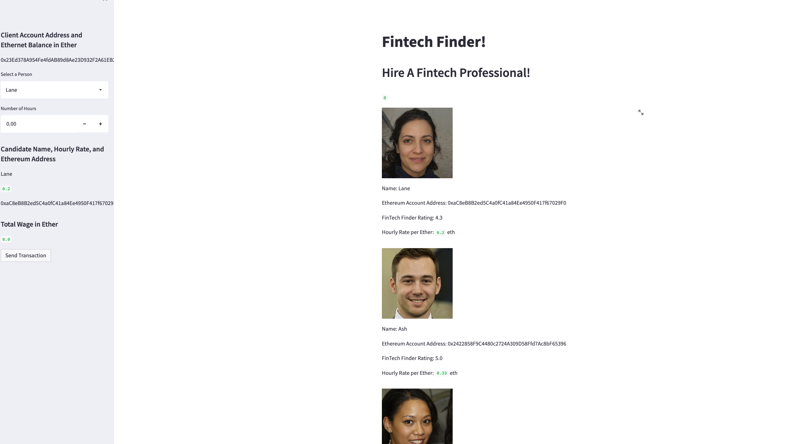
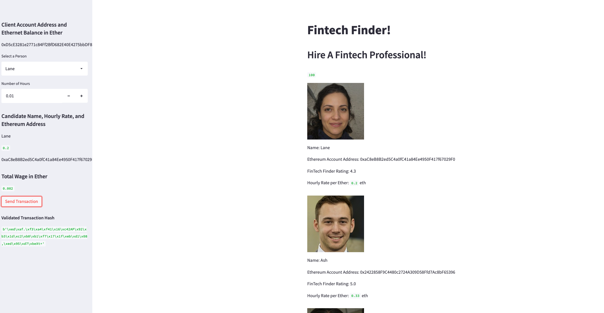
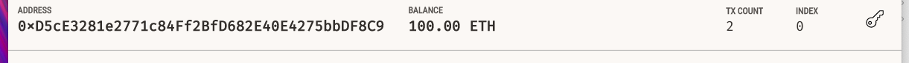

# Module_19

## Fintech Finder
The goal of this challenge was to find a fintech professional and hire them via Eth payments

## Requirements
Libraries Used
- Streamlit
- Dotenv
- bip44
- web3

## Visuals

Assignment by Matthew Rudd 